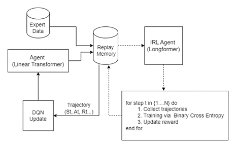

# Deep Reinforcement Learning for Music Generation

This repository is for an implementation of music generation with Reinforcement Learning in PyTorch. We adopt the DQN as main policy to generate music sequentially, the reward is 

## Model architecture



# Getting started
## Install Dependencies

```
pip install -r requirements.txt
```

## Dataset
We use the "AIlabs-Pop1K7" as training dataset, which can be download [here](https://github.com/YatingMusic/compound-word-transformer/tree/main).  


## Pre-trained Weights
Linear Transformer is our pre-trained weights of agent model, which can be downloaded [here](https://drive.google.com/file/d/1qRALPNx--GCzLJqrkEfP0bcm91jpkvcI/view?usp=sharing).


## Run the Codes
Our expertiment is based on the unconditional generation with Reinforcement Learning using PyTorch framework in Python.

* Pretrain: 
```
python agent_pretrain.py
```

* Training
```
python IRL_dqn_train.py

```

* Evaluation
```
## Generate midis songs in './gen_midis ##

python testing-no-type-cp.py

```

## Demo
Our generated midi files can be downloaded [here](https://drive.google.com/drive/folders/13HKoJLNTd_gKfzMb2OlZP4nKBRlLHfQ3?usp=sharing).
