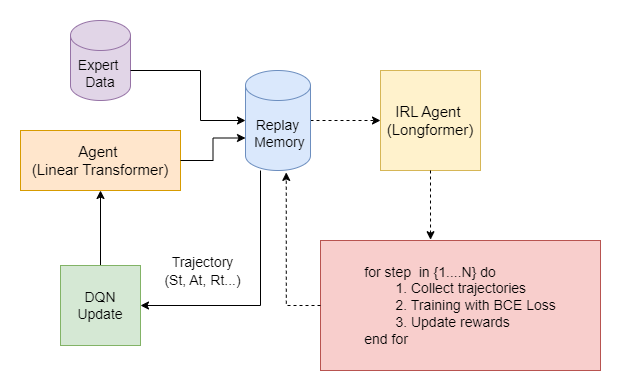
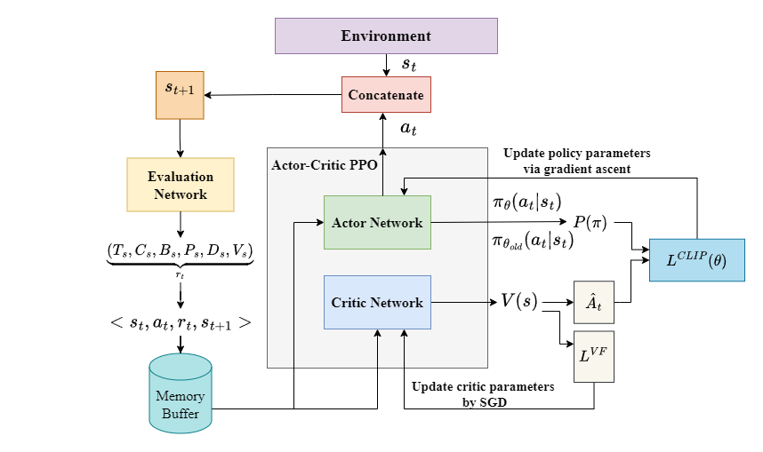

# Automated Music Composition Using Deep Reinforcement Learning

This repository is an implementation of automated music composition with Reinforcement Learning(RL) in PyTorch.
We design a novel deep reinforcement learning-based framework with the self-attention-based neural networks for long-sequence music generation, which differs from the conventional Generative Adversarial Network (GAN).
Additionally, we utilize  Deep Q Network (DQN)-based and Proximal Policy Optimization (PPO)-based techniquein Reinforcement Learning (RL) with the transformer model to generate pop-style piano music
sequentially

## Model architecture
###  DQN-Baed Architecture


###  PPO-Baed Architecture



# Getting started
## Install Dependencies

```
pip install -r requirements.txt
```

## Dataset
We use the "AIlabs-Pop1K7" as training dataset, which can be download [here](https://github.com/YatingMusic/compound-word-transformer/tree/main).  


## Pre-trained Weights
Linear Transformer is our pre-trained weights of agent model, which can be downloaded [here](https://drive.google.com/file/d/1qRALPNx--GCzLJqrkEfP0bcm91jpkvcI/view?usp=sharing).


## Run the Codes
Our expertiment is based on the unconditional generation with Reinforcement Learning using PyTorch framework in Python.

* Pretrain: 
```
python agent_pretrain.py
```

* Training
```
python IRL_dqn_train.py

```

* Evaluation
```
## Generate midis songs in './gen_midis ##

python testing-no-type-cp.py

```

## Demo
Our generated midi files can be downloaded [here](https://drive.google.com/drive/folders/13HKoJLNTd_gKfzMb2OlZP4nKBRlLHfQ3?usp=sharing).
